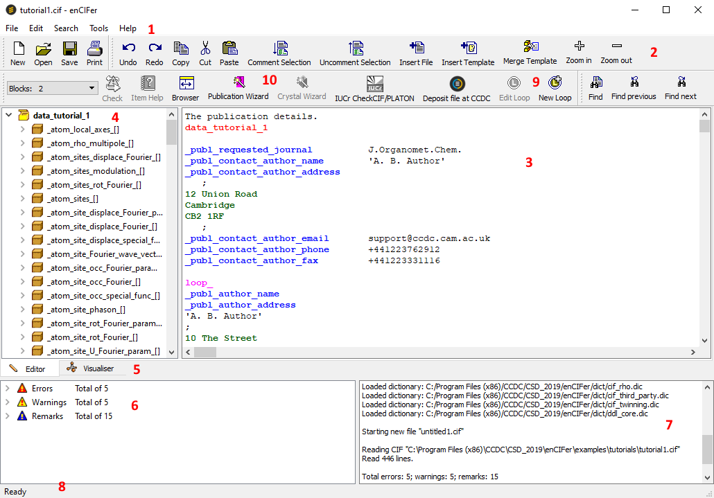
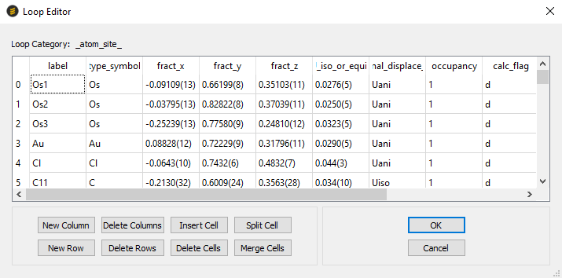
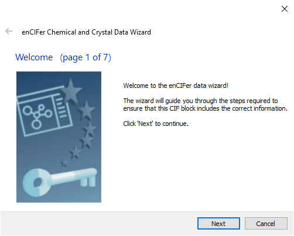

# General Features of EnCIFer

## Acknowledgements

The CCDC gratefully acknowledges the following copyright works, which
are used under licence in EnCIFer:

- Qt, the platform-independent GUI application framework: www.qt.io

- Mesa C 1999-2001 Brian Paul:
    [www.mesa3d.org](http://www.mesa3d.org/)

- PCRE library package, by Philip Hazel, and copyright by the
    University of Cambridge, England:
    [www.pcre.org](https://www.pcre.org/)

## Scope of the Program

The EnCIFer program operates on single or multi-block CIFs to permit:

- Location and reporting of syntax/format violations using the
    currently enabled dictionary.

- Correction of these syntax/format violations.

- Editing of existing individual data items or looped data items.

- Addition of new individual data items or looped data items.

- Addition of certain *standard* additional information via two data
    entry wizards:

- Publication wizard - basic bibliographic information required by
    most journals and databases that accept CIF deposition documents.

- Data wizard - chemical and physical property information that
    enhances a CIF for journal or database deposition.

- Visualization of structure(s) in the CIF.

- Consistency checks on a small number of data fields.

- Additional crystallographic and publication checks via a link to the
    checkCIF/PLATON service provided by the IUCr.

In all cases where data is edited or added, EnCIFer will check the
format integrity of the amended file.

Thus, EnCIFer is designed to ensure that CIFs are syntactically correct
before they are archived, transmitted or used as input to other
software, e.g. data validation programs or structure visualizers. The
visualization and other checking features also aid users in validating
the content and semantics of the CIFs.

## Overview of the Interface

The EnCIFer interface consists of the following:



1. Top-level menu - comprising **File**, **Edit**, **Search**,
    **Tools** and **Help** menus.

1. Tool bar - containing many common program options.

1. Text editor - for CIFs with syntax highlighting.

1. Browser - allowing CIF dictionary navigation.

1. Structure Visualiser - for displaying the crystal structure(s) in
    CIFs.

1. Error list view - for displaying and navigating error, warning and
    remark messages.

1. Scrolling log - message window.

1. Status bar - displaying help messages and line/column numbers.

1. Loop editor - spreadsheet view of loop constructs

1. Wizards - for entering crystal, chemical and publication data:





## Command Line Options

EnCIFer recognizes the following command line options:

```sh
encifer -style=<style>

encifer -directrendering

encifer -nodirectrendering

encifer <filename>
```

- `-style=<windows/motif/cde/plastique/cleanlooks>`, which changes
    the user interface style.

- `-directrendering` and `-nodirectrendering`: which enables or
    disables hardware acceleration. The default is `-directrendering`
    on all platforms. If problems are encountered with EnCIFer’s 3D
    display, try both values.

- `<filename>`, which opens the named file. Multiple files may be
    specified by separating the names with spaces.

- `-font <fontname>` — LINUX only — defines the application font.

*Note:* If EnCIFer is run for a second or subsequent time whilst it is
already running, then new files will be added to the existing instance,
rather than opening a new instance. In this case, any non-filename
command line arguments will be ignored. Also, if EnCIFer is set to reuse
a single window then only the first file specified will be opened.
