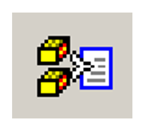

# File Operations

## Opening a CIF

When EnCIFer is launched, by default the **Editor** pane shows an empty
CIF, named `untitled1.cif`.

An existing CIF can be opened in a number of ways:

- Via the **Open** dialog box which is obtained either by selecting
    **File** > **Open**, by clicking the **Open** icon on the toolbar,
    or by using the **Ctrl+O** keyboard shortcut. Choose the file type
    (CIF `*.cif` or all files) you want and then choose the file you
    wish to open.

- When typing the `encifer` command (typically on UNIX), you can
    supply a file name on the command line, and EnCIFer will open the
    file when it starts.

- If you are using a computer that supports Drag and Drop, you can
    drag a file icon and drop it onto the EnCIFer program icon (or a
    shortcut to it). EnCIFer will launch and open the dropped file.
    Alternatively, you can drop a file icon onto the EnCIFer editor
    window, and the dropped file will be opened.

- A list of the most recently opened files is maintained by EnCIFer.
    These may be reopened by clicking **File** in the top-level menu,
    selecting **Recent Files** and then choosing the filename from the
    resulting pull-down list. A warning will result if the file is no
    longer found on the system.

- On Windows, the installer can associate files ending with `.cif` with
    EnCIFer, so that opening such a file will automatically load the
    file into EnCIFer.

- On macOS, EnCIFer will associate itself with `.cif` files, so that
    such files can be automatically opened in EnCIFer, or dragged and
    dropped onto an EnCIFer icon in the tray.

The CIF is read as a plain text file using the character set of the
native system (e.g. ISO-8859-1). The end-of-line sequences for Windows
(`<CR><LF>`), macOS (`<CR>`) and UNIX/Linux (`<LF>`) are
all interpreted as indicating a new line irrespective of the native
system. As a result, all versions of EnCIFer can read plain text files
generated on Windows, macOS and UNIX/Linux systems.

## Single Window and Multiple Window Operation

By default, each CIF is opened in a new EnCIFer window. Alternatively,
EnCIFer may be configured to reuse the current window when opening
files. To configure this behaviour:

1. Hit **Edit** on the top-level menu and select **Preferences**. In
    the **Preferences** dialog box, click the **General** tab.

1. Click the radio buttons **Use multiple windows** or **Reuse single
    window** to set the desired behaviour.

1. Click the **OK** button to apply changes, **Cancel** to discard
    changes or **Restore Defaults** to restore the default setting.

## Creating a New CIF

A new empty CIF `untitledn.cif` may be opened by:

- Clicking **File** on the top-level menu and selecting **New**.

- Clicking on the **New** icon on the toolbar.

- Using the **Ctrl+N** keyboard shortcut.

This will open a new window if the **Use multiple windows** preference
is set. If the **Reuse single window** preference is set, then any of
the above actions will replace the current window contents with an empty
file.

## CIF Template File

EnCIFer may be configured to open a template CIF rather than showing an
empty file when starting up and when **New** or **New Window** is
selected. This may be useful when publishing CIFs in order to avoid
editing the same values into multiple files.

This template file may also be inserted into the editor at the current
cursor position either by:

- Hitting **Edit** in the top-level menu and selecting **Insert
    Template**.

- Clicking the **Insert Template** icon on the toolbar.

To set the template file:

- Hit **Edit** on the top-level menu and select **Preferences**.

- In the **Preferences** dialog box, select the **Editor** tab, click
    the **Browse** button and select the template file in the **Open**
    dialog box.

- Check the **Always start with template** box for the template to be
    automatically used whenever a new file is created, instead of an
    empty file.

## Merge CIF Template

Data items in the CIF template may be merged into the current CIF block,
with the option to preserve or overwrite existing data values. This may
be useful in order to set standard data item values in an automatically
generated `.cif` e.g. publication details or diffractometer parameters.

The template file may be merged into the block at the current cursor
position either by:

- Hitting **Edit** in the top-level menu and selecting **Merge
    Template**.

- Clicking the **Merge Template** icon on the toolbar:

In the resulting dialog, choose the block(s) in the template CIF which
you wish to merge into the current block.

If the **Overwrite data items in current block** checkbox is unchecked,
data items will only be copied from the template file if the data items
are not present in the current block. Looped data items will only be
copied if none of the data items in the loop are set in the current
block.

If the **Overwrite data items in current block** checkbox is checked,
data items from the template file will replace any data items, including
looped data items, already present in the current block.

## Insert File

Text may be inserted into the current **Editor** pane from a CIF or
plain text file using the **Insert File** option in the top-level
**Edit** menu or by clicking the **Insert File** icon on the toolbar.

In the resulting **File** dialog box, choose the file type (CIF `*.cif`
or all files) you want and then select the file you wish to open. The
contents of the file are inserted into the editor at the current cursor
position.

If the text contains characters which are not part of the CIF character
set, they will be converted to CIF digraph or trigraph sequences where
possible. For example, accented characters in the ISO-8859-1 (Latin 1)
character set are converted to the corresponding CIF character
sequences.

## Close File

CIFs may be closed either by:

- Hitting **File** on the top-level menu and selecting **Close File**.

- Using the **Ctrl+W** keyboard shortcut.

If there are other EnCIFer windows open from the same session, the
current window is closed. Otherwise, if there is only one EnCIFer
window, a new `untitledn.cif` file is opened in this window.

If the current file has been modified, a dialog box will prompt whether
to save changes to the current file. Click **Yes** to save changes,
**No** to discard changes or **Cancel** to abort the operation.

## Saving Files

To save the current CIF:

- Hit **File** in the top-level menu and **Save** in the next menu.

- Click the **Save** icon on the toolbar.

- Use the **Ctrl+S** keyboard shortcut.

- If the current editor contains a new CIF, the **Save As** dialog box
    opens which allows you to specify the name and location of the file
    to be created.

To save an automatic backup copy of the current CIF each time the CIF is
saved, select the **Save backup CIFs** option in the **Preferences**
dialog box:

1. Hit **Edit** in the top-level menu and select **Preferences**.

1. In the **Preferences** dialog box, click the **General** tab.

1. Check the **Save backup CIFs** box to enable this feature.

The backup of CIF `filename.ext` will be saved as
`filename_backup.ext`.

To save the current CIF with another filename:

1. Hit **File** in the top-level menu, **Save As** in the next menu.

1. This opens the **Save As** dialog box which allows you to specify
    the name and location of the CIF to be created or replaced.

1. CIFs are saved as plain text with the end-of-line termination
    characters appropriate to the native system, i.e. `<CR><LF>`
    for Windows, `<CR>` for macOS and `<LF>` for UNIX/Linux,
    irrespective of the end-of-line sequence(s) present in the file when
    it was opened in EnCIFer.

## Printing Files

The CIF in the current editor may be printed by:

- Hitting **File** in the top-level menu and selecting **Print**.

- Clicking the **Print** icon on the toolbar.

- By using the **Ctrl+P** keyboard shortcut.

In each case, a **Print** dialog box appears which enables the printer
to be set up. The options available in this dialog box depend on the
operating system. If you have a colour printer, you can print the CIF in
colour to show the syntax highlighting as displayed in the **Editor**
pane.
