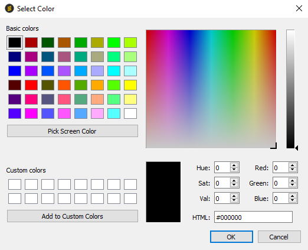

# Text Editor

CIFs are edited in a plain-text **Editor** window. If the **Visualiser**
is displayed, click on the **Editor** tab to return to the **Text
Editor**.

## Syntax Highlighting

Text is highlighted according to the CIF syntax. This helps to give a
visual indication of potential errors. The default scheme is as follows:

- Data block header: *bold red text*.

- Loop keyword: *bold magenta text*.

- Data names in any of the currently enabled dictionaries: *bold blue
    text*.

- Data names not in any of the currently enabled dictionaries: *bold
    dark blue text*.

- Comments: *italic green text*.

- Multi-line text blocks (semicolon delimited): *bold dark green
    text*.

- Special characters and mark-up sequences: *bold dark yellow text*.

- Superscripts/subscripts: *blue text*.

- Superscript/subscript markers: *bold grey text*.

- Other (Normal) text: *black*.

- Invalid CIF characters (e.g. non-breaking space characters): *bold
    underlined purple text*.

To change the style settings:

1. Hit **Edit** on the top-level menu and select **Preferences**.

1. In the resulting dialog box, click the **Editor** tab and then
    select the button alongside click **to change style settings**.

1. The **Editor style** **settings** dialog box should now appear. This
    shows the current style and color settings along with a sample of
    each type of text highlighting in a pane on the left.

At the top, the font name and size used for all styles (except special
characters) is displayed, special characters will use a ‘Symbol’ font of
the same size. The **Change** button to the right can be used to set
this font. When adjusting only the size and name will be used, any bold,
italic or other style settings will be ignored.

Next to each style are checkboxes to set **bold**, *italic* and
underline styles. There is also a button displaying the currently
used color, pressing this brings up a **Color selection** dialog:

To restore the default settings:

- Click on the **Defaults** button. You will be asked to choose
    between a **Variable Width** or **Fixed Width** font. Variable Width
    will use the default application font for your system; Fixed Width
    will use a ‘Courier’ font of the same size. It may be more
    convenient to use a fixed-width font to maintain column alignment,
    especially in large loops.

As settings are adjusted, the text in the **Sample** pane is immediately
updated to reflect the style changes. Text in the editor windows will
only be updated when the preferences dialogs are closed by selecting
**OK** in both the **Editor style settings** and **Preferences** dialog
boxes. Selecting **Cancel** will discard any changes.

## Scaling the Editor Text

To enlarge the text in the editor:

- Click **the Zoom-in (+)** icon on the toolbar.

To reduce the size of the text in the editor, click the **Zoom-out**
**(-)** icon on the toolbar.

These actions are a shorthand way of opening the **Preferences** dialog
and adjusting the font size.

## Data Item Dictionary Help

To show the *CIF dictionary information* for a data item, place the
cursor on the data name in the **Text Editor**, and either:

- Right-click on the data name and select **Item help** from the
    resulting menu.

- Use the **Ctrl+I** keyboard shortcut.

- Click **Item Help** on the toolbar:

The data item name and the dictionary in which the data name is defined
are shown in the title box, and the scrolling window provides the
definition, recommended values (enumeration list) and examples taken
from the dictionary.

## Editing Text

Text may be typed into the **Editor** pane in the same way as for a
regular plain text editor. Due to the arbitrary width nature of the CIF
format, there is no line wrapping and hard line breaks must be entered
as appropriate. For an explanation of the different line limits (see
[Soft Line-Length Limit](encifer-07.md#soft-line-length-limit)).

Double-clicking in the text selects the word (text delimited by white
space) at the current cursor position. To select all text in the editor,
hit **Edit** on the top-level menu and click **Select All**, or use the
**Ctrl+A** keyboard shortcut.

The status bar at the bottom of the EnCIFer window reports the line and
column number at the current cursor position, and whether the file has
been modified since it was last saved.

CIFs must be composed in a limited character set. Other special
characters (e.g. Greek letters and mathematical symbols) must be input
according to the CIF markup conventions. The special character markup
sequences may be shown by hitting **Help** on the top-level menu and
selecting **Special characters**. Click the **Close** button to dismiss
the **Special characters** dialog box.

## Copy, Cut and Paste

To copy selected text to the clipboard, either:

- Hit **Edit** on the top-level menu and select **Copy**.
- Click the **Copy** icon on the toolbar.
- Use the **Ctrl+C** keyboard shortcut.

To cut selected text to the clipboard, either:

- Hit **Edit** on the top-level menu and select **Cut**.
- Click the **Cut** icon on the toolbar.
- Use the **Ctrl+X** keyboard shortcut.

To paste text from the clipboard, either:

- Hit **Edit** on the top-level menu and select **Paste**.
- Click the **Paste** icon on the toolbar.
- Use the **Ctrl+V** keyboard shortcut.

EnCIFer uses the system clipboard for copy, cut and paste operations, so
text may be cut and pasted to and from other applications, e.g. word
processors or text editors. Plain text clipboard content will be used.
It may be necessary to insert hard line breaks in the pasted text in
EnCIFer.

If the text contains characters which are not part of the CIF character
set, they will be converted to CIF digraph or trigraph sequences where
possible. For example, accented characters in the ISO-8859-1 (Latin 1)
character set are converted to the corresponding CIF character
sequences.

Cutting and pasting text in EnCIFer containing such characters provides
an automatic way of converting the special characters to CIF characters
sequences where possible. The sequence **Select al**l > **Copy** >
**Paste** can be used to force all special characters in a CIF to be
adjusted.

## Undo and Redo

The last editor operation may be reversed by either:

- Hitting **Edit** on the top-level menu and then selecting **Undo**.

- Clicking the **Undo** icon on the toolbar.

- Clicking the **Undo** icon on the toolbar.

- Using the **Ctrl+Z** keyboard shortcut.

The last editor operation to be undone may be redone by either:

- Hitting **Edit** on the top-level menu and selecting **Redo**.

- Clicking the **Redo** icon on the toolbar.

- Using the **Ctrl+Y** keyboard shortcut.

Certain operations may require two undo or two redo steps.

## Find and Replace

### Find

To find text in the editor, either:

- Hit **Search** on the top-level menu and select **Find**.

- Click the **Find** icon on the toolbar.

- Use the **Ctrl+F** keyboard shortcut.

A **Find Text** dialog box should appear:

1. Type the required text into the **Find** edit box. Tick any of the
    options **Whole words only**, **Case sensitive**, **Start at
    Beginning**, and select the search direction (**Forward** or
    **Backward**) by clicking the appropriate radio button. Then click
    the **Find** button to find the text.

1. If the text is found, the cursor will move to the text which will be
    highlighted.

1. To repeat the find operation, click the **Find** button again whilst
    the dialog box is still displayed.

1. To dismiss the **Find Text** dialog box, click the **Close** button.

If the **Find** dialog is reopened the previous search text will be
displayed. Other previously searched for items are available via a
drop-down list.

### Find Next and Find Previous

To find the next match either:

- Hit **Search** on the top-level menu and select **Find next**.

- Click the **Find next** icon on the toolbar.

- Use the **F3** keyboard shortcut.

To find the previous match either:

- Hit **Search** on the top-level menu and select **Find previous**.

- Click the **Find previous** icon on the toolbar.

- Use the **Ctrl+F3** keyboard shortcut.

### Replace

To replace text in the editor either:

- Hit **Search** on the top-level menu and select **Replace**.

- Use the **Ctrl+R** keyboard shortcut.

A **Replace Text** dialog box should appear:

1. Type the text to be replaced in the **Find** edit box and the
    replacement text into the **Replace** edit box. Tick any of the
    options **Whole words only**, **Case sensitive**, **Start at
    Beginning**, and select the search direction (**Forward** or
    **Backward**) by clicking the appropriate radio button.

1. Click **Find Next** to find the next match, **Replace** to replace
    the text for the currently highlighted match, or **Replace All** to
    replace all occurrences of the text.

1. Click the **Close** button to dismiss the dialog box.

As with the **Find** dialog, if the **Replace** dialog is reopened the
previous search and replace texts will be displayed. Other previously
searched for and replacement texts are available via a drop-down list.

## Line and Block Navigation

To move to a particular line either:

- Hit **Search** from the top-level menu and select **Go to line**.

- Use the **Ctrl+G** keyboard shortcut.

- In the resulting dialog box, type the desired line number and click
    on the **Go** button.

To move to the start of a particular block, select the required block
from the **Blocks** pull-down menu on the toolbar.

To show line numbers alongside the **Editor**, select the **Show line
numbers** option in the **Preferences** dialog box:

1. Hit **Edit** on the top-level menu and select **Preferences**.

1. In the **Preferences** dialog box, click the **Editor** tab.

1. Check the **Show line numbers** box to enable this feature.

## Comment and Uncomment

In CIF, comments are begun by a # character and continue until the end
of the line.

Lines can be quickly commented (a # prepended) out by selecting
**Comment Selection** from the **Edit** menu or by using the **Toolbar**
button.

Lines can be uncommented (a single # removed) by selecting **Uncomment
Selection** from the **Edit** menu or by using the **Toolbar** button.

When no text is selected these commands will affect only the current
line. If a block of text is selected, then all selected lines will be
adjusted. Only a single # will be prepended or removed for each use of
these commands, so if a selection contains a mixture of commented and
uncommented lines the differences will be preserved.
