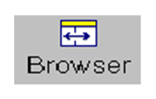
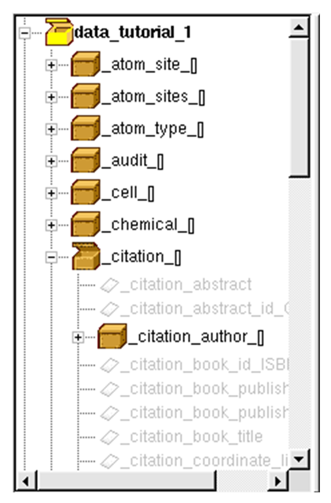

# Browser

The browser provides a hierarchical view of the CIF in terms of the data
blocks and their data items, the hierarchy being defined by the
arrangement of data categories, sub-categories and data items in the
currently enabled dictionaries. It provides a means of navigating the
blocks and data items in the CIF and allows additional data names to be
inserted into the editor text.

## Enabling the Browser

To toggle the display of the browser:

- Hit **Tools** in the top-level menu and select **Browser**.

- Click the **Browser** icon on the toolbar:

- Use the **Ctrl+B** keyboard shortcut.

To adjust the width of the browser relative to the editor, drag the
vertical splitter bar (the <-||-> cursor should appear).

## Expanding and Contracting the Browser

When the **Browser** is first displayed, it shows the CIF data blocks as
**Closed yellow box** icons. Double-clicking on the **Box** icon, or
clicking the **[+]** or **[>]** icon, expands the view to show the
data item categories in black text with closed orange boxes, the data
block now shows an **Open yellow box** icon.

Expanding these categories shows the data names within that category,
the category boxes change to show open box icons. The data names may not
be expanded further and are displayed differently depending on their
status:

- Data names which are present in the current block are shown in black
    text and have item icons.

- Data names which are not set are shown in grey and have grey item
    icons.

- Items which are looped appear in black text with a double item icon.

- Items which have errors or warnings related to their value appear in
    black with a warning icon.

To contract the display for a category or data block, double-click on
the **Open box** icon or click the **[-]** icon alongside:

*Note:* If the browser becomes difficult to navigate because of too many
dictionary items, it is possible to disable unused dictionaries (see [CIF Dictionary Options](encifer-07.md#cif-dictionary-options)).

## Browser Navigation

### Block Navigation

To move to a particular **Block** in the editor, either:

- Right-click on the corresponding data block name and select **Go to
    block** from the resulting menu.

- Select the data block name from the pull-down **Blocks** list on the
    toolbar.

Both the **Browser** and **Text Editor** will scroll to ensure that the
data block names are displayed in the viewing areas and are highlighted.

### Item Navigation

Double-clicking on a data name which has been set (shown in black), or
right-clicking and selecting **Go to item** will move the cursor to the
data name in the editor and highlight the matching text. This is *not*
possible for data items which have not been set in the current block.

## Inserting and Copying Data Names

Right-clicking on a data name which has not been set (shown in grey) and
selecting **Paste into editor** inserts the data name into the editor at
the current cursor position. This is not possible for data items which
are already set in the current block.

A data name may be copied to the clipboard by right-clicking on the data
name and selecting **Copy item name** from the resulting menu.

## Data Item Dictionary Help

CIF dictionary help is available both for data names and data categories
by right-clicking on the text in the browser and selecting **Item help**
from the resulting menu.

## Setting Data Items

Data items may be set or reset by:

1. Right-clicking on the data name text in the browser and selecting
    **Set data item value** from the resulting menu. The resulting
    dialog box shows the dictionary data item help and allows the data
    value to be input.

1. If the data item has an enumeration list in the dictionary, the
    enumerated values are shown in a pull-down list, in addition to
    `?` (unknown) and **`.`** (not applicable). Select the
    appropriate data value from the list.

1. Otherwise, an **Text** edit box is shown. Type the data value in the
    box. No quotes are required, these are added automatically by
    EnCIFer.

1. Click the **OK** button to apply the changes. The CIF will be
    re-parsed automatically and the new data highlighted. Else, click
    the **Cancel** button to abort the change.
