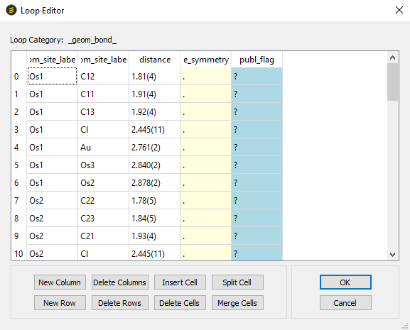
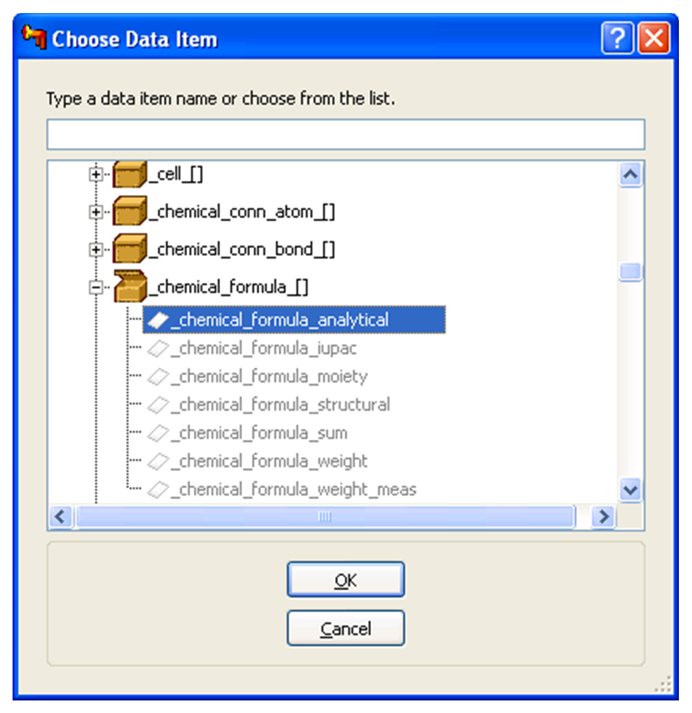

# Loop Editor

## Overview of Loops

Loops may be constructed or modified in a loop editor spreadsheet as an
alternative to using the **Text Editor** pane. The **Text Editor** is
disabled whilst the **Loop Editor** is in use.

It is strongly recommended that syntax errors are corrected before using
the **Loop Editor**. Otherwise, if there are CIF syntax errors which
affect the loop, some data may be lost if edits made in the **Loop
Editor** are applied to the CIF.

The **Loop Editor** preserves comments associated with the data names.
Any comments interspersed between the data values in the loop will be
moved to between the last data name and the first data value.

## Creating a New Loop

A new loop may be inserted at the current cursor position in the
**Editor** pane by hitting **Tools** on the top-level menu and selecting
**New Loop** or by selecting the **(L)+** icon from the toolbar. The new
loop initially has no rows or columns.

A new loop may not be inserted on lines comprising a semicolon-delimited
multi-line string, including those lines with the opening and closing
semicolons, and the icon is disabled in this case.

## Editing an Existing loop

An existing loop may be opened in the **Loop Editor** by placing the
cursor on a line containing the `loop_` keyword in the **Editor**
pane, which enables the **(L)** toolbar icon. Selecting this icon, or
hitting **Tools** on the top-level menu and selecting **Edit Loop**,
starts the **Loop Editor**, which provides a spreadsheet view of the
loop data.

The CIF will be automatically re-parsed if necessary before the
spreadsheet view is shown:

## Loop Display

The common prefix of all the data names in the loop is displayed next to
the **Loop Category** label, the remaining text of each data name are
shown as column headings in the spreadsheet. Rows are numbered
sequentially. Spreadsheet cells are colour-coded according to data
content: grey for empty cells, yellow for cells containing `.` and
blue for cells containing `?`.

Cells that give CIF dictionary errors (i.e. where the data value is
incompatible with the CIF dictionary definition of the data item) show a
yellow warning triangle.

Data item help may be obtained by right-clicking on a spreadsheet cell.
This shows a dialog box containing the dictionary definition for the
data item in the column, provided that the data name is present in a
currently enabled dictionary.

## Editing Cells

Cells may be edited by first double-clicking in the spreadsheet cell and
then editing the contents, or by highlighting a cell and typing.
Pressing **Return** or **Enter** applies changes to the spreadsheet cell
and revalidates the data value.

## Applying and Discarding Changes

Changes made in the **Loop Editor** are applied to the CIF in the **Text
Editor** by clicking on the **OK** button. This button is deactivated
whilst a cell is being edited.

Changes made in the **Loop Editor** may be discarded by clicking the
**Cancel** button.

Changes applied to the **Text Editor** may be undone by:

- Hitting **Edit** in the top-level menu and selecting **Undo**.

- Using the **Ctrl+Z** keyboard shortcut.

This is done in one step for a new loop or two steps for an existing
loop (the first undo step removes the modified loop text, and the second
undo restores the original loop text).

## Resizing Columns and Rows

Columns may be resized by left-clicking and dragging the right-hand
boundary of the column header (a <-||-> cursor should appear) to
change the column width. Alternatively, double-clicking whilst the
<-||-> cursor is shown resizes the column to accommodate the longest
text in the column, including the data item names in the column header,
when these are not highlighted in bold.

Rows may be resized by left-clicking and dragging the lower boundary of
the row header
(a <-||-> cursor should appear) to change the row height.
Alternatively, double-clicking whilst the <-||-> cursor is shown
adjusts the row height to accommodate the current text in that row.

## Moving Columns and Rows

Individual columns may be moved by **Ctrl**+**Left-Clicking** a column
header (a <--> cursor should appear) and dragging the cursor to a
column boundary. The column will be moved to a position to the left of
the column boundary.

Individual rows may be moved by **Ctrl**+**Left-Clicking** a numbered
row header (a <--> cursor should appear) and dragging the cursor to a
row boundary. The row will be moved to a position below the row
boundary, and the rows will be renumbered to preserve the sequential
numbering, i.e. rows do not retain their original numbering when moved.

## Adding New Columns, Rows and Cells

### Adding Columns

A column may be added by clicking on the **New Column** button to show
the **Choose Data Item** dialog box. A data name must be provided in
order to create a new column for that data item. The data name may be:

- Typed into the **Text** edit box.

- Entered into the **Text** edit box by double-clicking a data item in
    the currently enabled dictionary from the `data_dictionary`
    expandable list view.

- Entered into the **Text** edit box by right-clicking on the data
    item in the `data_dictionary` list view and selecting **Paste into
    editor** from the resulting menu.

Initially, the list view shows all data item categories. The list view
may be expanded by clicking the **[+]** boxes to show data item names.
The browser expansion is retained between successive new column
operations, to facilitate construction of loops with related data items.

Data item dictionary help is available for data categories and data
items in the browser by right-clicking and selecting **Item help** from
the resulting menu:

- Clicking the **OK** button adds a column to the loop spreadsheet at
    the right of the spreadsheet, provided that a data item name has
    been entered in the **Text** edit box.

- Clicking the **Cancel** button aborts the process of adding a new
    column.

All cells in the new column are given initial values of `.` so that
the existing cell alignment is unchanged.

### Adding Rows

A new row may be added to the spreadsheet, after the last row, by
clicking the **New Row** button. Rows cannot be added to a spreadsheet
which has no columns (e.g. when creating a new loop).

Cells in the new row are not given values and unless given values will
not be written out when the **Loop Editor** exits.

### Adding Cells

An individual cell may be added before the current cell with the
**Insert Cell** button. This provides a means of fixing loop alignment
where spacing has been omitted between data values in the loop.

## Selecting Columns, Rows and Cells

Columns are selected by left-clicking column headers displaying the data
item names. Multiple contiguous column selections are made by
**Shift+Left-Clicking** a range of column headers.

Rows or groups of rows are selected by left-clicking or
**Shift+Left-Clicking** on the numbered row header sections.

Cells are selected by left-clicking. Contiguous blocks of cells may be
selected by **Shift+Left-Clicking** and individual cells added to the
selection by **Ctrl+Right-Clicking**.

Blocks of cells can also be selected by holding the left mouse button
and dragging.

## Deleting Columns, Rows and Cells

Selected columns may be deleted by clicking the **Delete Columns**
button. If all columns are deleted, all the rows are also deleted as it
is not possible to have a table with columns but no rows in the **Loop
Editor**.

Selected rows may be deleted by clicking the **Delete Rows** button. The
remaining rows are renumbered to preserve sequential numbering. If all
rows are removed, the column headers are retained.

A selected range of cells may be deleted with the **Delete Cells**
button (the cells need not be contiguous). The remaining cells are moved
to the left, and up to the end of the row above where necessary, to
occupy spaces vacated by the empty cells. Incomplete rows remain
incomplete, and the deleted cells will not be written out when the
**Loop Editor** exits. The number of values in the loop will need to be
corrected or syntax errors will result. Any empty rows which result when
cells are removed are also deleted.

## Merging Cells

Adjacent cells spanning any number of rows may be merged into a single
cell. This can be useful when correcting loops where spaces have been
mistakenly added, or a value containing a space has not been quoted. To
merge cells:

- Select the cells you wish to merge (see [Selecting Columns, Rows and Cells](#selecting-columns-rows-and-cells))
    and click the **Merge Cells** button. All but one of the selected
    cells will be deleted, the remaining cell will contain the
    concatenated text of all the merged cells. The remaining cells will
    move as described above in **Deleting Columns**.

## Splitting Cells

The text in a single cell may be divided between the existing cell and a
new cell. This can be useful when correcting loops where spaces have
been mistakenly missed out between values.

To split a cell:

1. Double-click in the cell to obtain the editing cursor, as in
    **Editing Cells** above.

1. Use the cursor keys or click again to place the cursor at the
    position in the text you would like the cell to be split and click
    **Split Cell.**

1. A new cell will be inserted adjacent to the cell being edited with
    other cells being moved as in **Inserting Cells** above. Text to the
    left of the cursor will be placed in the left cell, text to the
    right of the cursor will be placed in the right cell.
