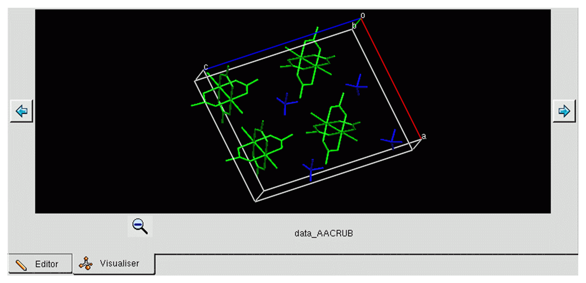

# Visualizer

## Visualizer Overview

Crystal structure visualizer windows may be displayed by clicking on the
**Visualiser** tab under the **Text Editor** window. These are
regenerated if the CIF has been re-checked since the visualizer windows
were last shown, to take into account any changes to the crystal data
blocks.

By default, a 2x3 grid of visualizer windows is shown, with one window
for each data block comprising crystal structure data. The caption under
each visualizer window gives the corresponding data block name.

If there are more than six crystal data blocks, you may page through the
blocks by clicking on the **Back** **<-** and **Forward** **->**
icons. If there is only one crystal structure block, a single visualizer
window is shown. And if there are no crystal structure blocks, an empty
grid of visualizer windows is shown.

To show a single visualizer window for one block:

1. Click the **Zoom-in (+) magnifier** icon, or select the desired data
    block name from the **Blocks** pull-down toolbar list.

1. Page through the crystal data blocks by clicking on the **Back**
    **<-** and **Forward** **->** icons.

1. The block displayed is changed by selecting the desired data block
    name from the **Blocks** pull-down toolbar list.

1. To return to the 2x3 grid of visualizer windows, click the
    **Zoom-out (-)** magnifier icon.

## Visualizer Warnings

As structures are loaded into the **Visualiser** additional messages
will be displayed in the Scrolling Log. Normally this will consist of
the text “Loading visualiser for block: \<data block name\>” for
each block loaded. It is possible for some extra warnings to be
displayed here relating to unknown element types and various
cross-checks of atomic displacement parameters.

## Right-Clicking in the Display Area

Right-clicking in the **Display** area generates menus which provide
access to many display options. The options available will depend on
whether you right-click on:

- A blank area in the **Display** window, away from objects such as
    atoms, bonds, centroids, planes or nonbonded contacts.

- Specific objects in the **Display** window, i.e. an atom, bond,
    centroid, plane or nonbonded contact.

Menu items will be greyed out if they are inapplicable given the current
state of the display.

## Picking Modes

The **Picking Mode** controls what happens when you left-click on items
in the **Display** area:

- Use of the default **Select** mode permits the selection of atoms by
    clicking on them in the **Display** area. Once selected, a set of
    atoms can be subjected to an operation, e.g. colouring, or used for
    a calculation, e.g. of a centroid.

- Picking atoms in **Label** mode will display their atom labels -
    pick again to switch off the label.

Use of **Measure Distance**, **Measure Angle** or **Measure Torsion**
modes permits the measurement of geometrical parameters by picking two,
three or four atoms, respectively.

To set the picking mode, right-click and select the **Picking Mode**
menu option, a sub-menu will be shown containing the various modes. The
working of these modes is explained below.

## Undoing Commands and Resetting the Display

### Undoing Commands

Undo and redo are available when a single structure is being displayed;
these actions are disabled when the 2x3 grid of structures is shown:

- Undo and redo are available via the **Edit** menu, toolbar buttons
    and **Ctrl-Z** and **Ctrl-Y** keyboard shortcuts.

- Undo and redo only affect changes made to the **Visualizer**
    display; they are entirely separate to the undo and redo options in
    the **Text Editor**.

- When the CIF content is changed and the visualizer updated, any
    previous undo and redo history is lost.

- If the view is switched from a single structure to the 2x3 display
    and back again, the undo and redo history is maintained.

- Each structure has its own separate undo and redo history.

- Actions performed whilst viewing the 2x3 display can be undone and
    redone if the view is switched to the relevant single structure.

### Resetting the Display to the Default View Direction, Scale and Perspective

The display area can be returned to the default view direction (viz.
looking down the crystallographic *b* axis) and default scale and
perspective:

- Right-click in the **Display** background, select **View** from the
    resulting menu and then hit **Reset View** in the next menu.

Any crystal packing or intermolecular contact information will be
retained in the resulting default view.

## Selecting and Deselecting Atoms and Molecules

### The Purpose of Selecting Atoms and Molecules

Selection of atoms or molecules is useful for changing properties such
as display style, calculating objects such as mean planes, etc. The
basic idea is that once a set of atoms has been *selected*, then one or
more operations can be performed on those atoms.

### Ways of Selecting Atoms and Molecules

Atoms may be selected or deselected in several ways:

- Right-click anywhere in the **Display** area (atom, bond or
    background) and choose **Selection** from the resulting menu.

- Set the **Picking Mode** to **Select** and click on individual atoms
    with the left mouse button to select them. Once selected, an atom
    can be deselected by clicking on it again.

- When the **Picking Mode** is set to **Select**, all atoms become
    deselected if you left-click anywhere in the display-area
    background.

- Press the **Shift** key and then click on any atom to select or
    deselect the entire molecule containing that atom.

### Identifying Selected Atoms

Atoms which are selected are indicated by small yellow wireframe
spheres.

## Moving the Display and Setting the View Direction

### Translating the Display

The contents of the **Display** area can be translated in several ways:

- By holding the middle mouse button down while moving the cursor in
    the display area (three-button mouse only).

- By moving the cursor in the display area while keeping both the
    left-hand mouse button and the **Ctrl** key pressed down.

### Rotating the Display

The contents of the display area can be rotated by:

- Moving the cursor in the **Display** area while keeping the
    left-hand mouse button pressed down (*x* and *y* rotation).

- Moving the cursor in the **Display** area while keeping both the
    left-hand mouse button and the **Shift** key pressed down (*z*
    rotation).

### Scaling the Display

The contents of the **Display** area can be scaled (i.e. zoomed in or
out) by:

- Moving the cursor up and down in the **Display** area while keeping
    the right-hand mouse button pressed down.

### Viewing Along Crystallographic Axes

The contents of the **Display** area can be viewed along real cell axes
or reciprocal cell axes by:

- Right-clicking in the background, selecting **View** from the
    resulting menu, and then choosing the view direction from the
    resulting menu.

### Changing the Display Perspective

The display perspective can be changed by:

- Moving the cursor from side to side in the **Display** area while
    keeping the right-hand mouse button and the **Shift** key pressed
    down.

## Atom, Molecule and Background Display

### Types of Atom and Bond Display Properties

Atoms and bonds have several display properties that you can control:

- Their display style: wireframe, stick, ball-and-stick, spacefill or
    ellipsoid (displays the ADPs).

- Whether atoms are labelled or not. You have no control over what the
    label is, you can only control whether it is shown or not.

- Their colour: atoms can be coloured according to their element type
    (see [Standard Element Colours](encifer-11.md#standard-element-colours)) or their symmetry equivalence (see
    [Symmetry-Equivalence Colouring](encifer-11.md#symmetry-equivalence-colouring)), or can be assigned a user-specified
    colour.

- Whether atoms and bonds are displayed or hidden.

Display properties can be set:

- Globally, i.e. for all atoms in the display.

- For any specified set of atoms (see [Setting Display Properties for Particular Atom(s) or Bond(s)](#setting-display-properties-for-particular-atoms-or-bonds)).

### Setting a Global Display Style

To set all atoms to a new display style (wireframe, stick, ball and
stick, spacefill or ellipsoid), you must first ensure that no atoms are
selected (see [Identifying Selected Atoms](#identifying-selected-atoms)). You can then:

- Right-click in the **Display** area background, click **Styles**
    from the pull-down menu, and select the required style (**Wireframe,
    Capped sticks, Ball and stick, Spacefill** or **Ellipsoid**).

- Alter the ellipsoid settings (see [Setting Ellipsoid Display Options](#setting-ellipsoid-display-options)).

- Switch the display of bond-types on or off by right-clicking in the
    **Display** area background, picking **Styles** from the pull-down
    menu, and selecting **Display Bond Types** from the resulting
    pull-down menu.

- Identify aromatic rings by displaying a circle within each ring by
    right-clicking anywhere in the **Display** area background, picking
    **Styles** from the pull-down menu, and selecting **Display Aromatic
    Rings** from the resulting menu.

Display styles can also be set for individual atoms, bonds and molecules
(see [Setting Display Properties for Particular Atom(s) or Bond(s)](#setting-display-properties-for-particular-atoms-or-bonds)).

### Turning All Atom Labels On or Off

To switch all atom labels on or off, you must first ensure that no atoms
are selected (see [Identifying Selected Atoms](#identifying-selected-atoms)). You can then:

- Right-click in the **Display** area background, pick **Labels** from
    the pull-down menu, and select the required option (**Show labels,
    Hide labels**).

Atom labels can also be turned on and off individually (see [Setting
Display Properties for Particular Atom(s) or Bond(s)](#setting-display-properties-for-particular-atoms-or-bonds)).

### Setting a Global Colouring Scheme

To colour all atoms by element type (see [Standard Element Colours](encifer-11.md#standard-element-colours)) or
symmetry equivalence (see [Symmetry-Equivalence Colouring](encifer-11.md#symmetry-equivalence-colouring)), you must
first ensure that no atoms are selected (see [Identifying Selected Atoms](encifer-11.md#identifying-selected-atoms)).
You can then right-click in the **Display** area background,
pick **Colours** from the pull-down menu, and select the required option
(**Colour By Element, Colour by Symmetry Equivalence**).

Colours can also be set for individual atoms and molecules (see [Setting
Display Properties for Particular Atom(s) or Bond(s)](#setting-display-properties-for-particular-atoms-or-bonds)).

### Setting the Background Colour

You can switch between the default black background and an alternative
colour by right-clicking in the **Background** area and hitting **Draw
Backdrop**. The alternative colour will be a blue gradient.

### Setting Display Properties for Particular Atom(s) or Bond(s)

There are two methods for setting the display properties of a particular
atom, bond, molecule, or set of atoms:

- Select the atoms whose display properties you wish to change (see
    [Ways of Selecting Atoms and Molecules](#ways-of-selecting-atoms-and-molecules)). right-click in the
    **Display** area background, select the appropriate option from the
    pull-down menu (**Styles, Colours, Labels, Show/Hide**) and then
    choose the desired display-property setting from the next menu.

- Right-click on an individual atom or bond, select the appropriate
    option from the pull-down menu (**Styles, Colours, Labels,
    Show/Hide**) and then select the desired display-property setting
    from the next menu. The chosen setting will be applied to the atom
    or bond on which you clicked.

In addition:

- You can switch individual atom labels on and off by setting the
    **Picking Mode** to **Label** in the menu which results when the
    **Picking Mode** option is selected from the right-click background
    menu. left-clicking on an atom will then toggle its label on and
    off.

## Setting Ellipsoid Display Options

Displacement ellipsoids can be displayed for structures where the CIF
file contains Atomic Displacement Parameter values (Uequiv and Uij
values) (see [Atomic Displacement Parameters (ADPs)](encifer-12.md#atomic-displacement-parameters-adps)):

To display the Ellipsoid settings:

- Right-click in the **Display** area background, then select
    **Styles** > **Ellipsoid Settings**. This will open the **Ellipsoid
    Display Options** window which can be used to customize various
    settings.

The display options are as follows:

- **Probability level (%)**: use this to alter the probability level
    (thus size) the ellipsoids are displayed at. For crystal structures
    determined from neutron diffraction data or at low temperature, you
    may want to increase the probability level; for structures
    determined at high temperature, you may want to reduce the
    probability levels.

- **Draw hydrogens as fixed-size spheres**: use this tick box to
    control the display of H atoms. The radius used for the spheres is
    customizable.

- The **Draw principal ellipses** and **Draw Non-Positive-Definite
    atoms as cubes** tick boxes can be checked or unchecked to enable or
    disable the specified functionality. A non-positive-definite atom is
    termed as such when the corresponding ellipsoid cannot be
    represented in real space, e.g. the ellipsoid may have a negative
    volume. Non-positive-definite atoms therefore highlight a problem
    with the data, e.g. a particular element may have been determined as
    a carbon atom but it is in fact a nitrogen atom.

- Bonds can either be represented as **Wireframe** or **Stick**.

- You can use the **Defaults** button to return to the standard
    settings.

Further information about ADPs is provided
(see [Atomic Displacement Parameters (ADPs)](encifer-12.md#atomic-displacement-parameters-adps)).

### Using the Select Color Dialog Box

You may need to use the **Select Color** dialog box when choosing a
colour for an atom, molecule or other object:

There are several ways to select a colour:

- Click on one of the “Basic colors”.

- Click on the **Colour** palette.

- Click on one of the “Custom colors” (only possible if you have
    defined some earlier in the EnCIFer session).

- Click in the vertical **Lightness** slider.

- Type your required Red, Green *and* Blue values.

- Type your required *Hue*, *Saturation* and *Lightness* (i.e.
    **Val**.) values:

  - The **Hue** defines the colour, e.g. *0* is red, *120* is green,
        and *240* is blue.

  - The **Saturation** defines the amount of colour; *255* is fully
        saturated, whereas a colour with a saturation of zero is always
        white.

  - The **Lightness** can also be controlled; a *Lightness* of zero
        always gives black.

Once you have chosen the required colour, hit **OK** to continue.

To create a customized palette, you can choose a colour and then hit **Add To Custom Colors**. This adds the current colour
to the “Custom colors” area for use later in the same session.

## Atom and Molecule Colouring Conventions

### Standard Element Colours

When atoms are coloured by element (see [Setting a Global Colouring Scheme](#setting-a-global-colouring-scheme)),
each atom is assigned a colour depending on its element type.

Colours used for the common elements are:

- All other elements are coloured purple.

Element colours can be changed by right clicking in the visualizer window and selecting the option **Colours *->* Element Colours**.
This will display an **Element Colour Option***s* dialog in which colours can be customized.

### Symmetry-Equivalence Colouring

If all atoms are coloured **by Symmetry equivalence** (see [Setting a Global Colouring Scheme](#setting-a-global-colouring-scheme)),
each different molecule (or ion) in the crystal chemical unit is assigned a different colour (the crystal
chemical unit is the same as the asymmetric unit in the majority of
structures).

When a packing diagram is then constructed, any given molecule is
assigned the same colour as that of the molecule in the crystal chemical
unit to which it is related by crystallographic symmetry. This means
that molecules of the same colour are crystallographically (and
therefore chemically and geometrically) identical to each other.

For example:

- If the crystal chemical unit of a crystal contains only one
    molecule, and a packing diagram of several unit cells is
    constructed, all molecules will have the same colour, e.g.

- If the crystal chemical unit contains two chemically different
    molecules or ions, each will be assigned a different colour and the
    molecules in the packing diagram will have two colours, e.g.

- If the crystal chemical unit contains two molecules which are
    chemically identical but not related by crystallographic symmetry,
    each will be coloured differently and, again, the packing diagram
    will contain molecules of two colours, e.g.

## Measurement

### Measuring Distances, Angles and Torsions

Measurement mode can be set in two ways:

- By right-clicking in the **Display** area background, selecting
    **Picking Mode** and setting the **Picking Mode** in the resulting
    menu, viz. **Measure Distance, Measure Angle** or **Measure
    Torsion**.

- By right-clicking in the **Display** area (but not on an atom or
    bond), selecting **Measure from the pull-down menu**, and then
    choosing **Measure Distances, Measure Angles** or **Measure
    Torsions**.

Geometrical measurements (intramolecular or intermolecular) can now
be displayed by clicking on two atoms for a distance, three atoms
for an angle or four atoms for a torsion angle.

### Clearing Measurements

All geometrical measurements can be removed from the **Display** by:

- Clicking **Clear Measurements** in the tool bar near the top of the
    main window.

- Right-clicking in the **Display** area background and then hitting
    **Clear Measurements** in the resulting pull-down menu.

- Right-clicking in the **Display** area background, selecting
    **Measure** in the resulting pull-down menu, and then hitting
    **Clear Measurements** in the next menu.

- An individual measurement can be removed by right-clicking on any
    part of the green dotted line that does not lie on a chemical bond
    and selecting **Delete Measurement** from the resulting pull-down
    menu.

## Displaying Packing Diagrams (Unit Cells)

### Colouring Conventions for Unit Cell Axes

The crystallographic *a*, *b* and *c* axes are coloured red, green and
blue, respectively.

### Switching Packing On and Off

You can switch between displaying a packing diagram (the contents of a
single unit cell) or a single molecule - or, more precisely, the
molecule(s) in the crystal chemical unit by:

- Right-clicking in the **Display** area background, selecting
    **Packing** from the pull-down menu, and then using the **Molecule**
    or **Packing** options to switch between representations.
