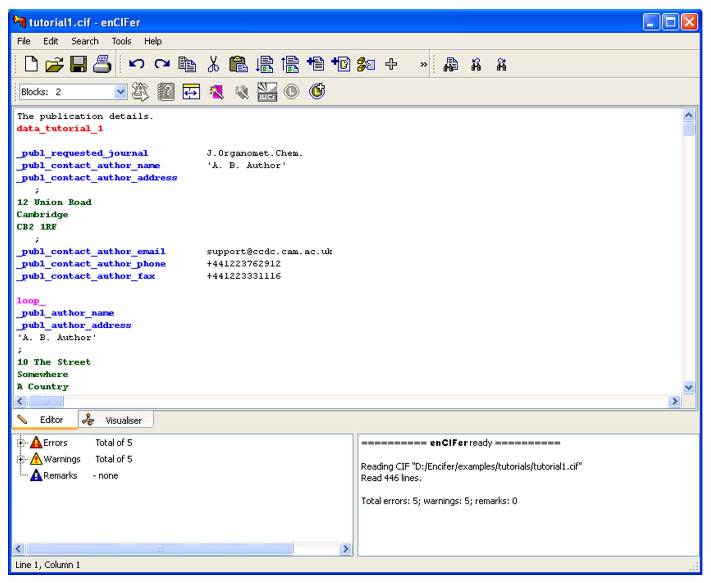
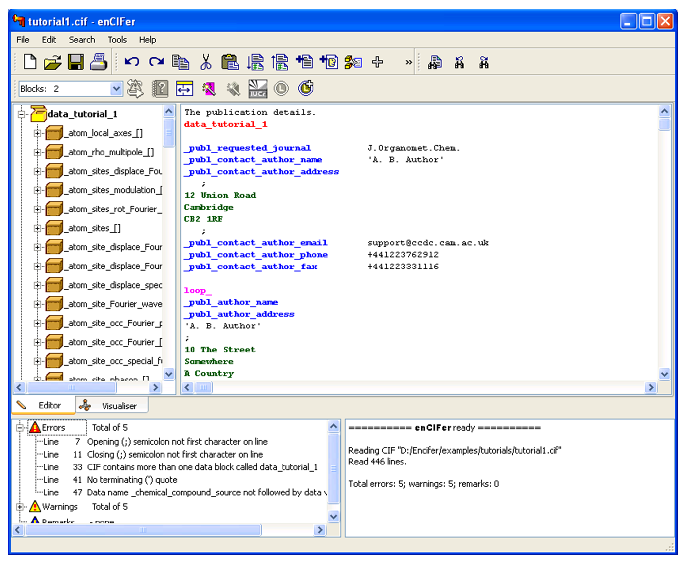
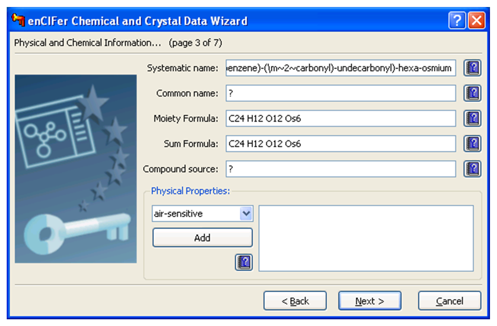
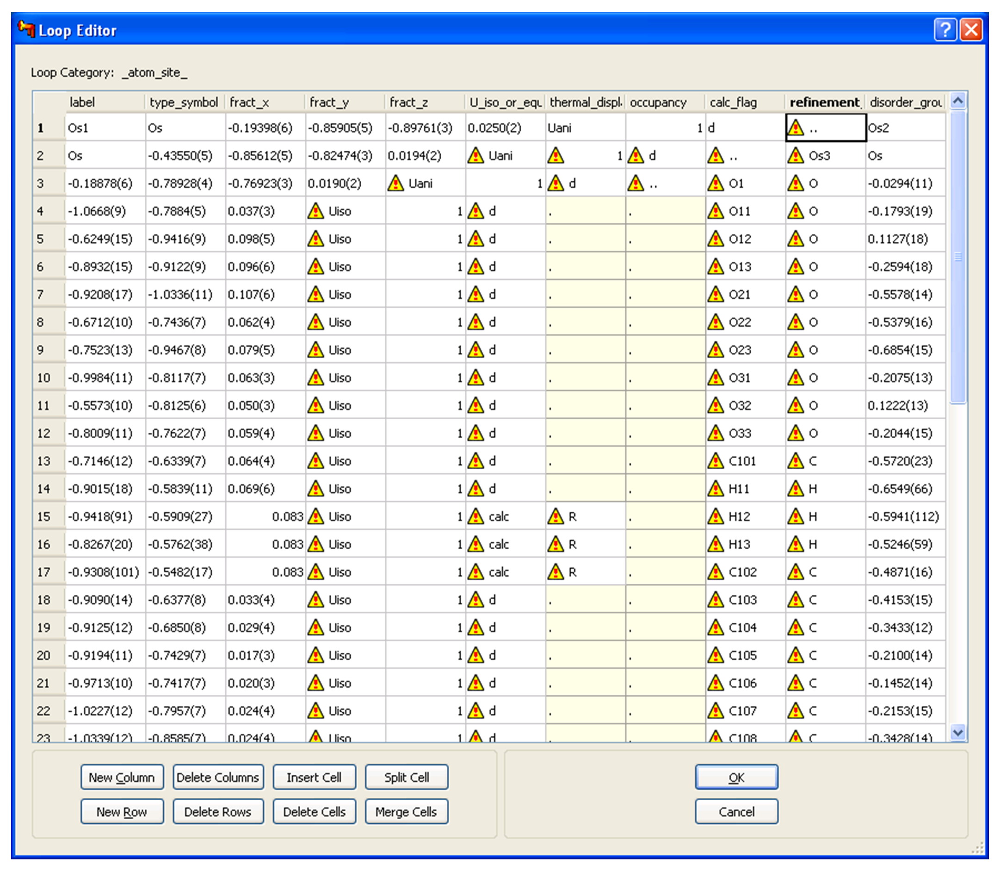
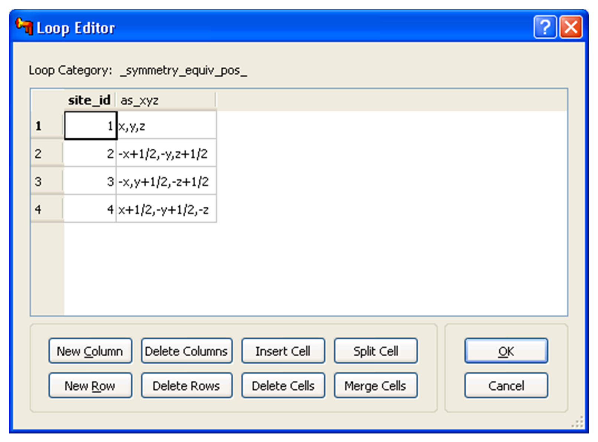

# Tutorials

## Tutorial 1: Viewing a CIF and Correcting Errors, Warnings and Remarks

### Objectives

To identify errors in an input CIF.

To correct the errors and save the resulting file.

### Steps Required

1. Open the CIF.

1. Fix all the syntax errors in the CIF.

1. Fix warnings.

1. Investigate remarks and fix where necessary.

1. Save the resulting error-free CIF.

### The Example

For the purpose of this tutorial errors have deliberately been
introduced into the example CIF, taken from the following journal
reference: C.M.Hay, N.E.Leadbeater, J.Lewis, P.R.Raithby, K.Burgess,
*New.J.Chem.*, **22**, 787, 1998 (CSD refcode SUDQUD).

### Menu Commands Required

#### Enable checking of mandatory data items

1. Select **Edit** on the top-level menu and select **Preferences**.

1. In the **Preferences** dialog box, click the **CIF** checking tab,
    then click the **Browse** button and select the template file `<InstallationDirectory>/Examples/Mandatory/recommended.cif`
    in the **Open** dialog box, and click the **Open** button.

1. Check the **Check for Mandatory Data Items box** to enable checking
    for mandatory data items.

1. Click **OK** to close the **Preferences** dialog box.

#### Open the CIF and save a copy

1. Click **File** on the top-level menu, and select **Open**. In the
    resulting **Open** dialog box, select the file: `<Installation
    Directory>/Examples/Tutorials/tutorial1.cif` and click the
    **Open** button.

1. The CIF should now be loaded in the editor with syntax highlighting.
    The error list view in the lower left of the window should report
    five errors, five warnings and fifteen remarks.

    

#### Fixing errors

1. Click the expand tab alongside the “Errors” red triangle icon, or
    double-click on the “Errors” list item. The list should expand to
    show five line numbers and associated error messages.

1. Double-click on the first error message, “Opening (;) semicolon not
    first character on line”. The cursor should move to the
    corresponding line in the editor, now highlighted in blue. To fix
    the error, delete the spaces before the semicolon so that it is the
    first character on the line (Do not re-check the CIF at this point).

1. Double-click on the second error message, “Closing (;) semicolon not
    the first character on line”, and edit the line to remove the
    leading spaces before the semicolon. The multi-line
    `_publ_contact_author_address` string should now be formatted
    correctly. Re-check the CIF now that you have corrected both the
    opening and terminating semicolons.

1. Double-click on the third error message, “CIF contains more than one
    data block called data_tutorial_1”. The second occurrence of
    `data_tutorial_1` in the editor should now be highlighted. Since
    data block names should be unique, change this data block name to
    `data_compound_1`.

1. Double-click on the next error message, “No terminating (‘) quote”.
    The problem is that a data value with spaces has an opening but not
    a closing quote. Edit the `_chemical_formula_moiety` to add the
    missing quote, i.e. `‘C28 H15 Au Cl O10 Os3 P’`.

1. Double-click on the error message, “Data name
    _chemical_compound_source not followed by data value”. Since each
    data name must be followed by a data value, and the source of the
    chemical is unknown, the data value should be edited to `?`
    (unknown).

1. To check that the errors are now fixed, click the check **CIF** icon
    on the toolbar or use the **Ctrl+K** keyboard shortcut (see [Keyboard Shortcuts](encifer-12.md#keyboard-shortcuts)).
    In order to expand the text on the toolbar select
    **Edit** from the top-level menu and then **Preferences**. From the
    resulting **Preferences** dialog box, click the **General** tab, and
    check the **Show text on toolbar buttons** checkbox, then hit the
    **OK** button to close; the icons should now be clearly labelled on
    the toolbar. The error list view should be updated to show no
    errors, five warnings and fifteen remarks.

#### Fixing warnings

1. Expand the list view to show all the warning messages, all of these
    should be listed with their corresponding line numbers. Double-click
    on the warning message “Ignoring uncommented string(s) before first
    data block”.

1. The first line of the CIF should be highlighted in the editor. The
    problem is that no hash character precedes the comment (this is
    necessary even for comments before the first data block). Select the
    **Comment Selection** command from either the **Edit** menu or
    toolbar. The line should then read: `# The publication details.`
    and be shown in green italic style (if the default text styles are
    being used).

1. Double-click on the warning “Data value is not in the dictionary
    enumeration list”. To determine the enumeration list of values for
    this data item, right-click on the text
    `_exptl_absorpt_correction_type`, select Item help from the
    resulting menu and a data item **Dictionary help** dialog box should
    open. Note that the recommended values include `psi-scan`, not
    `psiscan`. Click the **Close** button to dismiss the data item
    help dialog box. Edit the data value `psiscan` to `psi-scan`.

1. Double-click on the warning message “Ignored string R3mV”. The
    problem with this line is that the data value `Siemens R3mV` is
    not single or double-quoted, so the data value `Siemens` is
    associated with the data name `_diffrn_measurement_device` and
    the other text `R3mV` has been ignored. To fix the problem, add
    single quotes around the data value. The line should now read:
    `_diffrn_measurement_device ‘Siemens R3mV’`

1. Double-click on the warning message “Data value is not a correctly
    formatted number”. The line with the data item name
    `_diffrn_standards_decay_%` should be highlighted. The warning
    indicates that a numeric data value is expected for the data item
    according to the CIF dictionary but the value given does not conform
    to the CIF definition of a numeric value. In this case, the problem
    is that a percent sign has been included in the value where this is
    not necessary, as the data name indicates that the value is to be
    interpreted as a percentage. To fix the warning, delete the percent
    sign from the value.

1. Double-click on the last warning message, “More than 80 characters
    long” (this assumes the default soft line length limit is being
    used). To fix the warning, insert a line break between the data name
    `_refine_ls_weighting_details` and the quoted data value, such
    that the two lines are both within the 80 character soft line length
    limit.

1. To check that the warnings have now been fixed, re-check the CIF by
    clicking the **Check CIF** icon on the toolbar or by using the
    **Ctrl+K** keyboard shortcut. The error list view should now report
    no errors, no warnings and fifteen remarks.

#### Investigating remarks

1. Expand the list view to show the fifteen Remarks messages.

1. Double-click on the following message “Data item
    _diffrn_radiation_probe not found in block data_compound_1”. The
    data block name should be highlighted.

1. Click on the **Browser** icon on the toolbar, or use the **Ctrl+B**
    keyboard shortcut. A browser showing the names of the blocks
    `data_tutorial_1` and `data_compound_1` should appear to the left of
    the editor pane.

1. To adjust the relative widths of the browser and editor, drag the
    vertical splitter which divides them.

    

1. Expand the browser for “data_compound_1” by clicking the **Expand**
    icon or by double-clicking on the **Box** icon. The currently
    enabled dictionary categories should now be shown.

1. Expand the `_diffrn_radiation[]` category. Data items which are
    set in the block data_compound_1 are shown in black, data items
    which are not set are shown in grey.

1. Double-click on`_diffrn_radiation_monochromator`. The data item
    should now be highlighted in the editor. Insert a blank line under
    this data item and place the cursor at the beginning of this line.

1. In the browser, right-click the data name `_diffrn_radiation_probe`
    and select **Paste into editor**. The text should be pasted into
    the editor at the current cursor position, and the data item should
    now be shown in blue in the browser.

1. To see the allowed values for the data item, right-click on the data
    item in the browser and select **Item** **Help** from the resulting
    menu (alternatively, right-click on the data item in the editor).
    The appropriate value in this case is `x-ray`, so dismiss the data
    item help dialog box by clicking on the **Close** button, and type
    `x-ray` after the data name in the **Text Editor**. The line
    should then read `_diffrn_radiation_probe x-ray`

1. Alternately you can copy text from the **Item Help** dialog. In the
    above case this would mean clicking and dragging to highlight the
    text ‘x-ray’ in the dialog, then right-clicking and selecting
    **Copy**. Then after dismissing the dialog position the cursor next
    to the new data item and select **Paste**.

1. Re-check the CIF by clicking the check CIF icon on the toolbar or by
    using the **Ctrl+K** keyboard shortcut.

1. Double-click on the message “Data item
    _refine_ls_hydrogen_treatment not found in block data_compound_1”.
    The data block name should be highlighted.

1. Expand the `_refine_[]` category. Once again, data items which
    are set in the block “data_compound_1” are shown in black, data
    items which are not set (including
    `_refine_ls_hydrogen_treatment`) are shown in grey.

1. Double-click on the data item `_refine_ls_number_restraints`.
    This data item should now be highlighted in the editor.

1. In the browser, right-click the data name
    `_refine_ls_hydrogen_treatment` and select **Set data item
    value**.

1. The allowed values for the data item are shown in the **Data value
    edit** dialog box. The appropriate value in this case is `constr`,
    so select the data value `constr` from the pull-down enumeration
    list and click **OK**. The line should then read
    `_refine_ls_hydrogen_treatment constr`

1. Double-click on the remark: “Data item _symmetry_Int_tables_number
    not found in block data_compound_1”. The data block name should be
    highlighted.

1. Expand the `_symmetry_[]` category.

1. In the **Text Editor**, insert a blank line under the data item:
    `_symmetry_space_group_name_H-M` and place the cursor at the
    beginning of this line.

1. In the browser, right-click the data name
    `_symmetry_Int_tables_number` and select **Set data item value**.

1. The appropriate value in this case is `14`, so type this in the
    lower window in the edit data dialog. Click the **OK** button. The
    line should then read `_symmetry_Int_tables_number 14`

1. Double-click on the remark:
    “Data item _chemical_name_common not set in block
    data_compound_1”
    As the trivial name for this compound is unknown, the data value
    should be left as `?` (unknown).

1. Double-click on the remark “Data item _chemical_melting_point not
    set in block data_compound_1”. The melting point is also unknown, so
    the data value should be left as `?` (unknown).

1. Double-click on the remark “Data item _exptl_crystal_colour not set
    in block data_compound_1”. In this case, the crystal is known to be
    red in colour, so the data value `?` should be changed to `red`.

1. Re-check the CIF. The error list view should show no errors, no
    warnings and eleven remarks.

1. You may review the remaining remarks as a further exercise.

#### Save corrected CIF

1. Clear the scrolling list of messages in the lower right pane, by
    right-clicking on the pane and selecting **Clear** from the
    resulting pull-down menu.

1. Save the file by either hitting **File** on the top-level menu and
    selecting **Save**, by clicking the **Save** icon on the toolbar or
    by using the **Ctrl+S** keyboard shortcut.

1. Exit EnCIFer by hitting **File** on the top-level menu and selecting
    **Exit**, or by using the **Ctrl+Q** keyboard shortcut.

This ends the tutorial.

## Tutorial 2: Preparing a CIF for Deposition using the Data Entry Wizards

### Objectives

To add additional chemical, crystallographic and experimental data
    to a CIF.

To add author and journal information to the CIF.

### Steps Required

1. Open the example CIF and save a copy.

1. Add chemical, crystallographic and experimental data to the CIF
    using the Crystal **Data Wizard**.

1. Set your contact author details in the preferences.

1. Add author and journal data to a CIF using the **Publication Data
    Wizard**.

1. Save the augmented CIF.

### The Example

For the purpose of this tutorial, errors have been deliberately
introduced into the example CIF, taken from the following journal
reference: J.Lewis, Chi-Keung Li, M.R.A.Al-Mandhary, P.R.Raithby,
*J.Chem.Soc., Dalton Trans.*, 1915, 1993 (CSD refcode YARDAW).

### Menu Commands Required

#### Open the required CIF and save a copy

1. From the top-level file menu, select **Open** and browse to locate
    the CIF, which is located in: `<Installation
    Directory>/examples/tutorials/tutorial2.cif`.

1. Save a personal copy of this file. From the top-level file menu,
    select **Save As**, choose a file name in the resulting **Save As**
    dialog box and click the **Save** button to save the copy.

1. The CIF containing the data block `data_tutorial_2` should be
    loaded.

#### Add chemical, crystallographic and experimental data

1. Click on the data block name `data_tutorial_2` in the editor and
    click the Crystal Data Wizard icon. The introductory wizard page
    should appear.

1. Click on the **Next** button. The **CIF syntax checking** page
    should be shown, showing no Warnings or fatal errors. It may show
    several remarks if checking of mandatory data items has been enabled
    as detailed in tutorial 1. Click on the **Next** button again.

1. **Chemical Information** Enter the name
    `bis(eta6-benzene)-(mu2-carbonyl)-undecacarbonyl-hexa-osmium` into
    the **Systematic name** box. To conform with CIF conventions, this
    should be entered as:

    ```sh
    bis(\h^6^-benzene)-(\m\~2\~carbonyl)-undecarbonyl-hexa-osmium
    ```

1. There is not a known trivial name, so the **Common Name** box can be
    left as `?` (unknown).

    

1. Click on the help icon to the right of the **Compound source** box.
    This should display the data item dictionary help dialog box for
    `_chemical_compound_source`. Click the **Close** button to
    dismiss the dialog box. As the source is unknown, the existing value
    of `?` can be left unchanged.

1. The **Physical Properties** pane may be used to enter any relevant
    information about the crystal. To aid this, a list of common terms
    is provided in the drop-down list. These common terms can be
    appended to the text by first selecting a term and then pressing the
    **Add** button.

1. Click the **Next** button to show **Physical and Chemical
    Information** Enter `dark red` in the **Crystal Colour** box.
    Quotes should not be entered as the wizard will add these
    automatically.

1. Similarly, enter `parallelepiped` in the **Crystal Habit** box.

1. The **Recrystallisation Method** item should be used to list the
    solvents used in the crystal preparation. See the **Data item help**
    for full details of all the text which may be entered here.

1. Click the **Next** button to show the **Symmetry Information** page.
    The **Crystal system** pull-down box should show `orthorhombic`,
    the **International Tables space group number** `61` and
    **Hermann-Mauguin space group** **symbol** `P b c a`. Although
    these data are not set in the CIF, they are derived automatically by
    the wizard from the symmetry operators
    `_symmetry_equivalent_positions_as_xyz` in this case.

1. Click on the arrow on the **Hermann-Mauguin space group symbol**
    pull-down. This should display three possible settings for space
    group number 61; *?* (unknown), *P b c a* and *P c a b*. If you
    select *P c a b*, the wizard should report: “Warning: Space group
    symbol: P c a b does not agree with the given symmetry operators: P
    b c a.*”
    *To correct this error, change the symbol back to *P b c a*.

1. Click on the **Next** button to show the **Diffraction
    information.** The experiment was performed with an X-ray source, so
    click on the **Radiation Probe** pull-down list and select
    **X-ray**.

1. The radiation type and wavelength have been set correctly already so
    can be left unchanged.

1. If the **Absolute Configuration** of the structure is known, it may
    be selected here: see the **Data item help** for definitions of
    available terms.

1. Click **Next** to show the **Apply changes to CIF** page. Click
    **Finish** to apply the changes to the CIF in the editor.

#### Adding contact details to the preferences

1. As it is useful to include the same author contact details in any
    CIF which you may publish, these may be entered once in the
    preferences and saved for future use.

1. Hit **Edit** on the top-level menu and select **Preferences**. The
    **Preferences** dialog box should appear; click the **Wizard** tab
    to show the **Contact author details** pane.

1. Enter your name, email, address, telephone and fax numbers in the
    appropriate boxes. There is no need to enter any quotes as the
    Wizard will add these automatically.

1. Click the **OK** button to apply the settings.

#### Adding publication data

1. To add a publication data block above the data block
    `data_tutorial_2`, insert a few blank lines above the
    `data_tutorial_2` line in the editor.

1. Place the cursor at the beginning of the first blank line and hit
    the **Publication Wizard** icon on the toolbar (if there is more one
    or more crystal structure blocks in the CIF, it is usually more
    convenient to include publication data which is common to all
    structures in a single block above the crystal structure blocks).

1. The **Publication Data Wizard** should start. Click **Next** to show
    the errors and warnings page (there should be none). Again, there
    may be some remarks depending on preference settings.

1. Click the **Next** button again to show the **Contact Information**
    page. As there were no contact details in the CIF, the wizard fills
    in the boxes from the information set in the Wizard preferences
    automatically. The fields may be edited further if desired.

1. Click the **Next** button to show the **Publication Information**
    page. Assuming the structure is not yet published, click the button
    **is being submitted to a journal for publication**, and click the
    **Next** button again.

1. Start to type in the (abbreviated) requested journal name, `Dalton
    Trans.` into the **Text** edit box. As you type, the scrolling list
    box is updated to show matching journal titles. Double-clicking on
    the matching title completes the text in the **Text** edit box.

1. Click the **Next** button to show the author information page. As
    there are no authors given in the CIF, the contact details are
    automatically shown in the name and address boxes.

1. Click on the data item dictionary help icon for **Author name** to
    find out the correct format for entering author names, then click
    the **Close** button to dismiss the dialog box.

1. In the **Author address** box the address you entered into the
    preferences dialog should be shown, although you can edit the text
    if you wish.

1. Try adding another author name by clicking on the **Add** button.
    Enter the name in the **Family name and First name(s) or
    initial(s)** boxes (no quotes are required). The address of the
    first author is copied for the second author. Amend the address so
    that it is correct for the second author (this should span several
    lines). If you now click the **Previous** button, the boxes are
    updated to show the name and address of the first author.

1. To add further authors, click the **Add** button again.

1. Click the **Next** button to show the final page, and **Finish** to
    apply the changes to the CIF.

#### Save the augmented CIF

1. Save the file by hitting **File** on the top-level menu and
    selecting **Save**, by clicking the **Save** icon on the toolbar or
    by using the **Ctrl+S** keyboard shortcut.

1. Exit EnCIFer by hitting **File** on the top-level menu and selecting
    **Exit**, or by using the **Ctrl+Q** keyboard shortcut.

This ends the tutorial.

## Tutorial 3: Using the Loop Editor and Visualizer

### Objectives

To identify and correct loop errors in an input CIF.

Add a loop containing the symmetry operators.

To view the corrected structure and save the resulting file.

### Steps Required

1. Open the CIF and save a personal copy.

1. Fix loop errors in the spreadsheet **Loop Editor**.

1. Add a loop using the spreadsheet **Loop Editor**.

1. Check the structure in the **Visualizer**.

1. Save the CIF.

### The Example

For the purpose of this tutorial errors have deliberately been
introduced into the example CIF, taken from the following journal
reference: A.J.Amoroso, L.P.Clarke, J.E.Davies, J.Lewis, H.R.Powell,
P.R.Raithby, G.P.Shields, *J.Organomet.Chem.*, **635**, 119, 2001 (CSD
refcode CAFMOM).

### Menu Commands Required

#### Open the CIF and save a copy

1. Hit **File** on the top-level menu, and select **Open**. In the
    resulting **Open** dialog box, select the file: `<Installation
    Directory>/Examples/Tutorials/Tutorial3.cif`.

1. Save a personal copy of this file. From the top-level file menu,
    select **Save As**, choose a file name in the resulting **Save As**
    dialog box and click the **Save** button to save the copy.

1. The CIF should now be loaded in the editor with syntax highlighting.
    The error list view in the lower left of the window should two
    errors, sixteen warnings and twenty-one remarks. You may a different
    number of warnings if you have adjusted the **Maximum Consecutive
    Error Lines** preference setting. The presence of remarks assumes
    you have enable checking of mandatory data items as detailed in
    tutorial one.

#### Fixing loop errors

1. Click to expand the “Errors” in the error list view in the lower
    left corner of the EnCIFer window. Double-click on the first error
    message: *“*Too many or too few data values in the loop*”*. The
    `loop_` line above the looped data should be highlighted and the
    **Edit Loop** icon in the toolbar should become active. Click the
    **Loop Editor** button in the toolbar to show the **Loop Editor**
    spreadsheet.

1. You may wish to adjust the horizontal size of the spreadsheet to
    view all columns; this can be achieved by clicking and dragging the
    bottom right corner of the dialog. Alternatively, the view can be
    scrolled as required.

    

1. The spreadsheet shows that some of the data values are misaligned.
    Cells with unknown values (`?`) are coloured blue, inapplicable
    values yellow (`.`), empty cells grey and other cells white.
    Yellow warning triangles indicate that the data value does not
    conform to the recommended values for this data item (these also
    give rise to warnings in the **Editor**).

1. Scroll the spreadsheet view to examine the first row of the loop.
    The penultimate column contains the data value `..` and the last
    column an atom label. The error in this case is that both the loop
    columns `_atom_site_refinement_flags` and
    `_atom_site_disorder_group` *should* both contain the data
    value `.` but the space has been omitted, such that the first atom
    label in the next row is interpreted as the data value for
    `_atom_site_disorder_group`.

1. To fix this problem, double click in the penultimate cell on the
    first row containing the value `..` move the cursor between the
    two `.` characters (either by clicking again or using the cursor
    keys) and click the **Split Cell** button. The cell at this position
    will now contain a single `.` character and a new cell inserted
    also containing a single `.` character. Subsequent values will
    have moved forward by one position in the table.

1. Repeat these steps for the second and third rows of the table.
    Examine the spreadsheet to check that the data values are now
    aligned correctly in columns. The cells in both columns should now
    be coloured yellow.

1. The loop is now free from warning triangles and empty cells, click
    the **OK** button to apply the changes to the CIF displayed in the
    **Editor**.

1. The CIF is checked automatically upon exiting the **Loop Editor**.
    The error list view should now report one error, two warnings and
    twenty-one remarks.

1. Expand the error list and double-click on the remaining error
    message: *“*Too many or too few data values in the loop”. Click on
    the **Edit Loop** button in the toolbar to open this loop in the
    **Spreadsheet editor**.

1. Examine the spreadsheet view. The fourth row should contain four
    missing cells and three cells with data values. The second, third
    and fourth rows contain spurious inapplicable `.` data values
    which disrupt the loop alignment.

1. Click on first of the `.` data values, and then click on the
    **Delete Cells** button to remove the cell from the table. Repeat
    for the remaining 2 cells. You can also click in the first of these
    cells and then use **Ctrl+Left-Click** in the cells to select the
    three cells. The positions of the other cells should be adjusted to
    correct the column alignment, and the fourth row is deleted (as it
    would now contain only empty cells).

1. Click on the **OK** button to apply the changes to the CIF in the
    **Text Editor**. The error list view should now report no errors, no
    warnings and twenty-one remarks.

#### Adding a loop for the symmetry operators

1. Click on the **Visualiser** tab below the **Editor** pane.
    Right-click in the visualizer background and select **Packing** from
    the resulting menu. In the sub-menu, select **Packing**. This will
    produce a ‘Packing view’ pop-up box stating “Packing display will
    not correctly display structures without a valid cell and space
    group”. The problem is that no symmetry equivalent positions are
    given in the CIF nor any space group symbol. Return to the editor by
    clicking the **Editor** tab.

1. To add the symmetry equivalent positions, place the cursor in the
    editor on a blank line below the data item
    `_symmetry_cell_setting`, and click the **New Loop** icon on the
    toolbar. An empty **Spreadsheet editor** window should appear.

1. Click on the **New Column** button to show the **Choose Data Item**
    dialog box. This shows a CIF browser of data items in the currently
    enabled dictionary, expanded to show categories. Scroll down to show
    `_symmetry_equiv_[]` and expand the category to show data
    items (double-click on `_symmetry_equiv_[]` or click the
    expand box alongside).

1. Double-click on the data name `_symmetry_equiv_pos_site_id` to
    add it to the **Text** edit box, and click the **OK** button
    (alternatively, the data item name may be typed in the **Text** edit
    box). A column heading with this data item name should be added to
    the spreadsheet.

1. Click on the **New Column** button again, the **Choose Data Item**
    dialog box should still be expanded to show the
    `_symmetry_equiv_[]` data items. Double-click on the data name
    `_symmetry_equiv_pos_as_xyz` and click the **OK** button. The
    spreadsheet should now have two columns headed `site_id` and
    `as_xyz`, the common initial part of the data names
    (`_symmetry_equiv_pos_`) having moved to the **Loop Category**
    indicator.

1. As the space group is P212121 with four symmetry equivalent
    positions, click the **New Row** button four times to add four rows.
    An empty 2 x 4 table should now be shown in the spreadsheet.

1. Enter the data for the `site_id` and `as_xyz` columns as follows
    into the spreadsheet, by clicking on each cell, typing in the value,
    and pressing **Enter**. For convenience the
    `_symmetry_equiv_pos_as_xyz` values follow:

    ```sh
    x,y,z

    -x+1/2,-y,z+1/2

    -x,y+1/2,-z+1/2

    x+1/2,-y+1/2,-z
    ```

    

1. Once all the data have been entered, click the **OK** button to add
    the loop to the CIF in the **Text Editor**.

1. Set the data item `_symmetry_space_group_name_H-M` to `P 21 21
    21`. To find the data name, hit **Search** on the top-level menu
    and select **Find**, or use the **Ctrl+F** keyboard shortcut. In the
    resulting **Find Text** dialog box, type in the data item
    `_symmetry_space_group_name_H-M` (`_symmetry_sp` is adequate)
    and click the **Find** button. The corresponding text should be
    highlighted in blue in the editor. Click the **Close** button to
    dismiss the **Find** dialog. Change the data value from `?` to `P
    21 21 21`, remembering to add single or double quotes around the
    value.

1. Re-check the CIF (**Ctrl+K**). The error list view should now report
    no errors, no warnings and nineteen remarks.

1. Investigate the remaining remarks yourself and fix them where
    appropriate. To help do this it may be useful to refer back to
    tutorial one.

#### Viewing the crystal structure

Click on the **Visualiser** tab. As before in step 3, attempt to
    show the contents of one unit cell by right-clicking in the
    visualizer background and selecting **Packing** from the resulting
    menu and then clicking **Packing** in the sub-menu. Now the symmetry
    operators have been correctly assigned, the visualizer will show one
    unit cell with the cell axes colour-coded as a (red), b (green) and
    c (blue).

#### Saving the file

Save the file either by hitting **File** on the top-level menu and
    selecting **Save**, by clicking the **Save** icon on the toolbar or
    by using the **Ctrl+S** keyboard shortcut.

This ends the tutorial.
